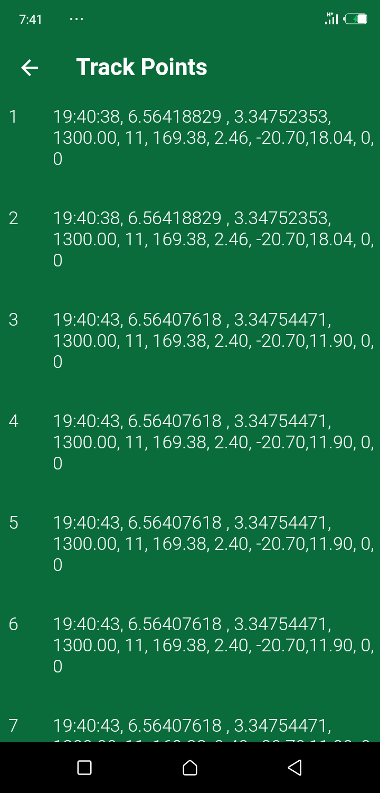

# GPS Logger App

This is a GPS logger app written in Flutter that allows users to log their current location's latitude and longitude. The app provides the ability to save location data on the phone or share it as a .txt file. The app also has the capability to communicate with an ESP32 Bluetooth device.
[This app was developed as a part of TetFund Assisted Research Projects for LoRa Assisted Smart Institution]

## Features

- Log the current location's latitude,longitude and other GPS info along with the LoRa module's info such as rssi and snr
- Save the location data on the phone
- Share the location data as a .txt file
- Communicate with an ESP32 Bluetooth device which communicates with the LoRa Module

## Requirements

- Android Studio or Visual Studio Code with Flutter SDK installed
- Android or iOS device to run the app

## Installation

- Clone the repository from GitHub
- Open the project in Android Studio or Visual Studio Code
- Run the commands below

```
flutter pub get
flutter build apk --no-shrink
```

## Usage

- For proper operation, make sure your location and bluetooth is ON
- Open the app
- Grant location permission if requested\
  

- Choose the mode of logging by pressing the 'A' button in the menu bar, Auto Mode by default logs every 60 seconds and Manual Mode let you choose the frequency of logging  
  Auto Mode\
  \
  Manual Mode\
  

- The location data will be displayed on the screen
- To view trackpoints, click the number icon (9).\
  

- The trackpoints are automatically saved anytime you terminate the app as the app continues to run in the background until it is cleared from memory.
- To set reference location, press the pencil icon on the menu bar. You can either set it manually or automatically.\
  

- To edit the time of interval of saving trackoint , press the timer icon. This is only available when the mode is set to auto\
  

- To share the location data as a .txt file, click on the History icon and choose the logs you want to share
- You can also view the previous trackpoints in the history.
- To communicate with an ESP32 Bluetooth device, make sure the bluetooth is ON, click on the bluetooth icon to switch it ON or choose the bluetooth devices.Once the ESP32 device comes up, click on it and choose it again from the list.\
  
- Once connected, data is sent to the bluetooth device and then the rssi and snr from the LoRa is sent back to the app.

## Contributing

Contributions to the project are welcome. To contribute, follow these steps:

Fork the repository
Create a new branch
Make your changes
Submit a pull request

# GPS Bluetooth Server

Just run the ESP32 code in the folder esp32,\
replace the demo with the procedure for using integrating LoRa with ESP32
